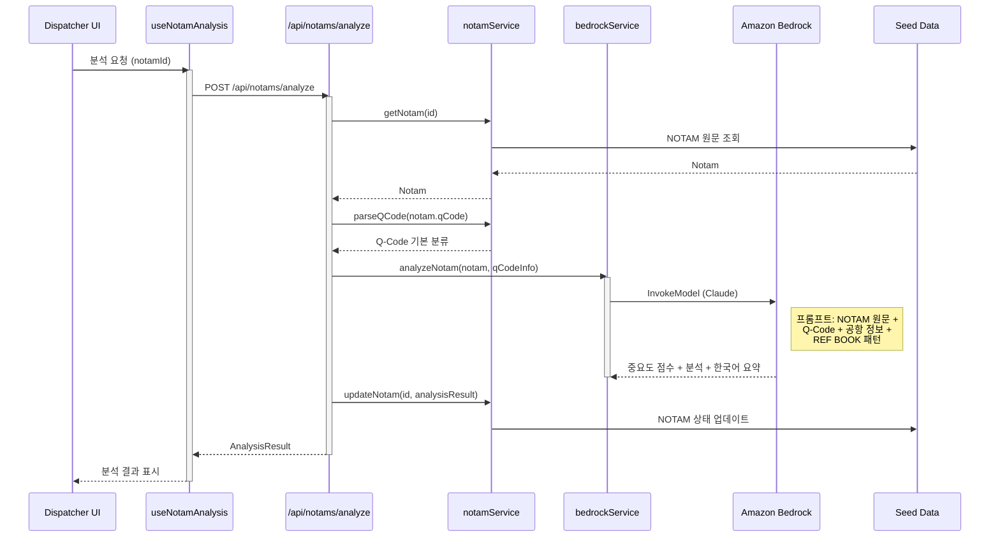
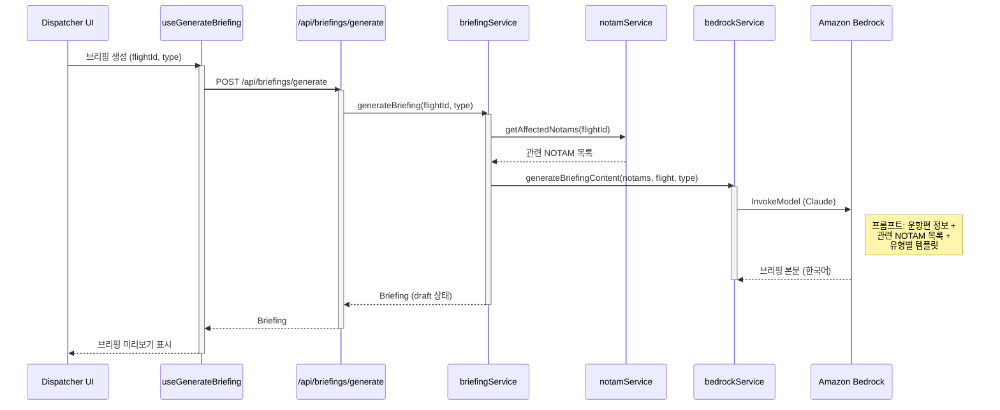
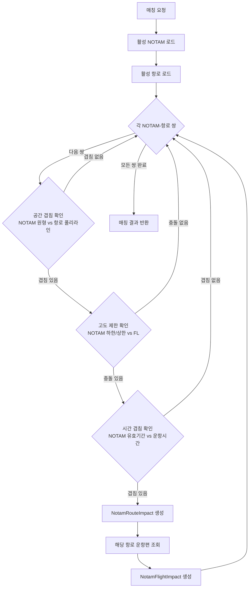

# 아키텍처 설계서 — 제주항공 AI NOTAM 분석 시스템

> 버전: 1
> 생성일: 2026-03-30
> Next.js 15 App Router + Cloudscape Design System v3+ + Amazon Bedrock

---

## 파트 1: 컴포넌트 트리

### 1.1 전체 애플리케이션 구조

```
src/app/layout.tsx (Server Component)
├── ThemeProvider
│   "use client" — Cloudscape 글로벌 스타일 적용
│
├── AuthContext.Provider
│   "use client" — 목 인증 상태 관리
│
├── NotificationContext.Provider
│   "use client" — Flashbar 알림 전역 관리
│
├── AlertContext.Provider
│   "use client" — 긴급 NOTAM 알림 배너 상태
│
├── TopNavigation (Cloudscape)
│   "use client" — AppLayout 외부 배치 (필수)
│   identity: "NOTAM 분석 시스템"
│   utilities: [알림, 교대 정보, 프로필]
│
└── AppLayout (Cloudscape)
    "use client"
    ├── navigation: SideNavigation
    │   섹션: 운항현황, 항로관리, 문서관리, 관리
    ├── breadcrumbs: BreadcrumbGroup
    ├── notifications: Flashbar
    └── content: {children} ← 각 페이지 렌더
```

### 1.2 대시보드 (/)

```
DashboardPage (Server Component)
├── CriticalAlertBanner
│   "use client"
│   Cloudscape: Flashbar
│   역할: 미확인 긴급 NOTAM 배너 표시
│
├── DashboardSummaryCards
│   "use client"
│   Cloudscape: Container, Header, Box,
│               ColumnLayout, StatusIndicator
│   역할: 요약 위젯 4개
│         - 전체 활성 NOTAM 수
│         - 긴급/중요 NOTAM 수
│         - 영향받는 항로 수
│         - 영향받는 운항편 수
│
├── RouteImpactMap
│   "use client"
│   Cloudscape: Container, Header, Select
│   외부: leaflet, react-leaflet
│   역할: 항로 폴리라인 + NOTAM 원형 영역
│         + 교차 영역 하이라이트 표시
│         항로 선택 필터 지원
│
├── RecentCriticalNotams
│   "use client"
│   Cloudscape: Table, Header, StatusIndicator,
│               Link, Badge
│   역할: 최근 긴급 NOTAM 목록 (최대 10건)
│
└── AffectedFlightsSummary
    "use client"
    Cloudscape: Container, Header, Table,
                StatusIndicator, Link
    역할: NOTAM 영향 운항편 요약 테이블
```

### 1.3 NOTAM 목록 (/notams)

```
NotamListPage (Server Component)
│
├── NotamTable
│   "use client"
│   Cloudscape: Table, Header, Pagination,
│               PropertyFilter, CollectionPreferences,
│               Button, Badge, StatusIndicator, Link
│   훅: useCollection (필터/정렬/페이지네이션)
│   역할: NOTAM 전체 목록 + 중요도 필터링
│         기본 뷰: critical + high 만 표시
│   ├── ImportanceBadge (공용)
│   └── NotamExpiryIndicator (공용)
│
└── NotamSplitPanelDetail
    "use client"
    Cloudscape: SplitPanel, KeyValuePairs,
                StatusIndicator, Badge, Box, Link
    역할: 테이블 행 선택 시 우측 패널에
          NOTAM 요약 정보 표시
```

### 1.4 NOTAM 상세 (/notams/[id])

```
NotamDetailPage (Server Component)
│
├── NotamRawAndParsed
│   "use client"
│   Cloudscape: Container, Header, ColumnLayout,
│               KeyValuePairs, Box, CopyToClipboard
│   역할: 원문 텍스트 + 파싱된 필드 양쪽 표시
│
├── NotamAiAnalysis
│   "use client"
│   Cloudscape: Container, Header, StatusIndicator,
│               ExpandableSection, Box, Button
│   역할: AI 중요도 점수, 분류, 한국어 요약,
│         영향 분석 결과 표시
│   └── ImportanceBadge (공용)
│
├── NotamImpactSection
│   "use client"
│   Cloudscape: Container, Header, Table,
│               StatusIndicator, Link, Tabs
│   역할: 영향받는 항로/운항편 탭 구분 목록
│
├── NotamMiniMap
│   "use client"
│   Cloudscape: Container, Header
│   외부: leaflet, react-leaflet
│   역할: NOTAM 위치 + 영향 반경 원형 표시
│
└── NotamDiffView (조건부)
    "use client"
    Cloudscape: Container, Header, Box,
                ColumnLayout
    역할: NOTAMR 교체 시 변경 사항 diff 표시
```

### 1.5 운항편 목록 (/flights)

```
FlightListPage (Server Component)
│
└── FlightTable
    "use client"
    Cloudscape: Table, Header, Pagination,
                PropertyFilter, CollectionPreferences,
                StatusIndicator, Link, Badge
    훅: useCollection
    역할: 운항편 목록 + NOTAM 영향 상태 표시
```

### 1.6 운항편 상세 (/flights/[id])

```
FlightDetailPage (Server Component)
│
├── FlightInfo
│   Cloudscape: Container, Header, KeyValuePairs,
│               ColumnLayout, StatusIndicator
│   역할: 편명, 출발/도착, 시간, 항공기 정보
│
├── FlightNotamImpact
│   "use client"
│   Cloudscape: Container, Header, Table,
│               StatusIndicator, Link, Badge
│   역할: 해당 편에 영향을 미치는 NOTAM 목록
│
├── FlightRouteMap
│   "use client"
│   Cloudscape: Container, Header
│   외부: leaflet, react-leaflet
│   역할: 운항 항로 + NOTAM 영향 영역 지도
│
├── FlightBriefingActions
│   "use client"
│   Cloudscape: Container, Header, Button,
│               Select, SpaceBetween
│   역할: 브리핑 생성 트리거 (종류 선택)
│
└── RouteDeviationGuidance
    "use client"
    Cloudscape: Container, Header, Table,
                StatusIndicator, Alert, Box
    역할: AI 항로 우회 권고 + 대안 항로 비교
```

### 1.7 항로 목록 (/routes) + 상세 (/routes/[id])

```
RouteListPage (Server Component)
└── RouteTable
    "use client" — useCollection 사용

RouteDetailPage (Server Component)
├── RouteInfo — 항로 기본 정보
├── RouteMapVisualization — 웨이포인트 지도
│   외부: leaflet, react-leaflet
├── RouteNotamImpacts — NOTAM 영향 목록
└── RouteAlternatives — 대안 항로 정보
```

### 1.8 REF BOOK (/ref-book)

```
RefBookPage (Server Component)
├── RefBookTable
│   "use client" — useCollection 사용
│   역할: REF BOOK 등재 목록 + AI 추천 표시
│
└── RefBookRegistrationModal
    "use client"
    Cloudscape: Modal, Form, FormField,
                Input, Textarea, Select
    역할: 신규 등재/편집 모달 폼
```

### 1.9 브리핑 문서 (/briefings, /briefings/[id])

```
BriefingListPage (Server Component)
└── BriefingTable
    "use client" — useCollection 사용

BriefingDetailPage (Server Component)
├── BriefingInfo — 메타 정보 (유형, 상태, 생성일)
├── BriefingContentPreview — 마크다운 미리보기
│   Cloudscape: Container, Header, Box, Tabs
│   역할: 유형별 탭 (요약문/Company NOTAM 등)
└── BriefingApprovalActions — 승인/반려 버튼
```

### 1.10 감사 로그 (/audit-log)

```
AuditLogPage (Server Component)
└── AuditLogTable
    "use client" — useCollection 사용
    역할: 디스패처 행위 기록 조회
```

### 1.11 공용 컴포넌트

```
src/components/common/
├── ImportanceBadge.tsx      중요도 레벨 색상 배지
├── ImportanceScoreBar.tsx   0.0~1.0 점수 프로그레스바
├── NotamExpiryIndicator.tsx 만료 카운트다운 표시
├── AirportLabel.tsx         공항 코드 + 팝오버 정보
├── LeafletMapWrapper.tsx    Leaflet 지도 공통 래퍼
├── LoadingState.tsx         로딩 스피너 + 텍스트
└── ErrorState.tsx           에러 알림 + 재시도 버튼
```

---

## 파트 2: 데이터 플로우

### 2.1 전체 아키텍처 개요

```mermaid
flowchart TB
    subgraph UILayer["UI Layer - Next.js App Router"]
        Dashboard["/ Dashboard"]
        NotamList["/notams NOTAM List"]
        NotamDetail["/notams/id Detail"]
        FlightList["/flights Flight List"]
        FlightDetail["/flights/id Detail"]
        RouteList["/routes Route List"]
        RouteDetail["/routes/id Detail"]
        RefBook["/ref-book REF BOOK"]
        Briefings["/briefings Briefings"]
        AuditLog["/audit-log Audit Log"]
    end

    subgraph HookLayer["Hook Layer - SWR"]
        useDashboard["useDashboard"]
        useNotams["useNotams"]
        useNotam["useNotam"]
        useFlights["useFlights"]
        useFlight["useFlight"]
        useRoutes["useRoutes"]
        useRoute["useRoute"]
        useRefBook["useRefBook"]
        useBriefings["useBriefings"]
        useAuditLog["useAuditLog"]
        useMutations["useMutation Hooks"]
    end

    subgraph APILayer["API Layer - Route Handlers"]
        NotamAPI["/api/notams"]
        FlightAPI["/api/flights"]
        RouteAPI["/api/routes"]
        RefBookAPI["/api/ref-book"]
        BriefingAPI["/api/briefings"]
        MatchingAPI["/api/matching"]
        DashboardAPI["/api/dashboard"]
        AuditAPI["/api/audit-log"]
        AuthAPI["/api/auth"]
    end

    subgraph ServiceLayer["Service Layer"]
        NotamService["notamService"]
        FlightService["flightService"]
        RouteService["routeService"]
        MatchingService["matchingService"]
        BriefingService["briefingService"]
        BedrockService["bedrockService"]
        AuditService["auditService"]
    end

    subgraph DataLayer["Data Layer"]
        SeedData[("Seed Data JSON")]
        Bedrock["Amazon Bedrock Claude"]
    end

    Dashboard --> useDashboard
    NotamList --> useNotams
    NotamDetail --> useNotam
    FlightList --> useFlights
    FlightDetail --> useFlight
    RouteList --> useRoutes
    RouteDetail --> useRoute
    RefBook --> useRefBook
    Briefings --> useBriefings
    AuditLog --> useAuditLog

    useDashboard --> DashboardAPI
    useNotams --> NotamAPI
    useNotam --> NotamAPI
    useFlights --> FlightAPI
    useFlight --> FlightAPI
    useRoutes --> RouteAPI
    useRoute --> RouteAPI
    useRefBook --> RefBookAPI
    useBriefings --> BriefingAPI
    useAuditLog --> AuditAPI
    useMutations --> NotamAPI
    useMutations --> BriefingAPI
    useMutations --> MatchingAPI
    useMutations --> RouteAPI

    NotamAPI --> NotamService
    FlightAPI --> FlightService
    RouteAPI --> RouteService
    MatchingAPI --> MatchingService
    BriefingAPI --> BriefingService
    DashboardAPI --> NotamService
    DashboardAPI --> RouteService
    DashboardAPI --> MatchingService
    AuditAPI --> AuditService

    NotamService --> SeedData
    NotamService --> BedrockService
    FlightService --> SeedData
    RouteService --> SeedData
    MatchingService --> SeedData
    BriefingService --> BedrockService
    BriefingService --> SeedData
    AuditService --> SeedData
    BedrockService --> Bedrock
```



### 2.2 NOTAM AI 분석 플로우



### 2.3 브리핑 생성 플로우



### 2.4 항로-NOTAM 매칭 플로우



---

## 파트 3: 요구사항 커버리지 매트릭스

| FR ID | 우선순위 | 페이지 | 주요 컴포넌트 | API 라우트 | 훅 |
|-------|----------|--------|---------------|------------|-----|
| FR-001 | P0 | /notams, /notams/[id] | NotamTable, NotamAiAnalysis, ImportanceBadge | /api/notams, /api/notams/analyze | useNotams, useNotamAnalysis |
| FR-002 | P0 | /notams, /notams/[id] | NotamTable, NotamRawAndParsed | /api/notams/[id], /api/q-codes | useNotam |
| FR-003 | P0 | /notams/[id] | NotamAiAnalysis, NotamImpactSection | /api/notams/[id]/impact-analysis | useNotam |
| FR-004 | P0 | /flights, /flights/[id], /notams/[id] | FlightTable, FlightNotamImpact, NotamImpactSection | /api/notams/[id]/affected-flights, /api/notams/[id]/affected-routes | useFlights, useFlight |
| FR-005 | P0 | /, /notams | DashboardSummaryCards, NotamTable, RecentCriticalNotams | /api/notams, /api/notams/stats | useNotams, useDashboard |
| FR-006 | P0 | /, /routes, /routes/[id] | RouteImpactMap, RouteTable, RouteMapVisualization | /api/dashboard/route-impact, /api/routes | useDashboard, useRoutes |
| FR-007 | P0 | /briefings, /briefings/[id], /flights/[id] | BriefingTable, BriefingContentPreview, BriefingApprovalActions | /api/briefings/generate, /api/briefings/[id] | useBriefings, useGenerateBriefing |
| FR-008 | P1 | /briefings, /briefings/[id], /flights/[id] | BriefingTable, BriefingContentPreview, FlightBriefingActions | /api/briefings/generate-crew, /api/briefings/[id]/crew-package | useBriefings, useGenerateBriefing |
| FR-009 | P1 | /flights/[id], /routes/[id] | RouteDeviationGuidance, FlightRouteMap, RouteAlternatives | /api/routes/[id]/alternatives | useRouteAlternatives |
| FR-010 | P0 | /routes, /routes/[id] | RouteTable, RouteNotamImpacts, RouteMapVisualization | /api/matching/calculate, /api/matching/results | useRoutes, useRoute |
| FR-011 | P1 | /ref-book | RefBookTable, RefBookRegistrationModal | /api/ref-book, /api/ref-book/[id] | useRefBook |
| FR-012 | P1 | /notams/[id] | NotamRawAndParsed, NotamAiAnalysis, NotamMiniMap | /api/notams/[id] | useNotam |
| FR-013 | P1 | /flights, /flights/[id] | FlightTable, FlightInfo | /api/flights, /api/flights/[id] | useFlights, useFlight |
| FR-014 | P1 | /briefings | BriefingTable | /api/reports/shift-handover | useBriefings |
| FR-015 | P1 | /notams/[id] | NotamAiAnalysis | /api/notams/[id]/summarize | useNotam |
| FR-016 | P1 | / | CriticalAlertBanner, RecentCriticalNotams | /api/notams/alerts | useDashboard |
| FR-017 | P2 | /audit-log | AuditLogTable | /api/audit-log | useAuditLog |
| FR-018 | P2 | /notams/[id] | NotamDiffView | /api/notams/[id]/diff | useNotam |
| FR-019 | P2 | /notams | NotamTable, NotamExpiryIndicator | /api/notams | useNotams |

---

## 파트 4: 디렉토리 구조

```
src/
├── app/
│   ├── layout.tsx                    루트 레이아웃 (TopNav + AppLayout)
│   ├── page.tsx                      대시보드
│   ├── loading.tsx                   루트 로딩 UI
│   ├── notams/
│   │   ├── page.tsx                  NOTAM 목록
│   │   └── [id]/
│   │       └── page.tsx              NOTAM 상세
│   ├── flights/
│   │   ├── page.tsx                  운항편 목록
│   │   └── [id]/
│   │       └── page.tsx              운항편 상세
│   ├── routes/
│   │   ├── page.tsx                  항로 목록
│   │   └── [id]/
│   │       └── page.tsx              항로 상세
│   ├── ref-book/
│   │   └── page.tsx                  REF BOOK 관리
│   ├── briefings/
│   │   ├── page.tsx                  브리핑 목록
│   │   └── [id]/
│   │       └── page.tsx              브리핑 상세
│   ├── audit-log/
│   │   └── page.tsx                  감사 로그
│   └── api/
│       ├── auth/
│       │   └── login/route.ts
│       ├── notams/
│       │   ├── route.ts              GET 목록
│       │   ├── analyze/route.ts      POST AI 분석
│       │   ├── alerts/route.ts       GET 긴급 알림
│       │   ├── stats/route.ts        GET 통계
│       │   └── [id]/
│       │       ├── route.ts          GET 상세
│       │       ├── summarize/route.ts
│       │       ├── impact-analysis/route.ts
│       │       ├── affected-flights/route.ts
│       │       ├── affected-routes/route.ts
│       │       └── diff/route.ts
│       ├── flights/
│       │   ├── route.ts
│       │   └── [id]/route.ts
│       ├── routes/
│       │   ├── route.ts
│       │   └── [id]/
│       │       ├── route.ts
│       │       ├── alternatives/route.ts
│       │       └── impact/route.ts
│       ├── ref-book/
│       │   ├── route.ts
│       │   └── [id]/route.ts
│       ├── briefings/
│       │   ├── route.ts
│       │   ├── generate/route.ts
│       │   ├── generate-crew/route.ts
│       │   └── [id]/
│       │       ├── route.ts
│       │       └── crew-package/route.ts
│       ├── matching/
│       │   ├── calculate/route.ts
│       │   └── results/route.ts
│       ├── reports/
│       │   └── shift-handover/
│       │       ├── route.ts
│       │       └── [id]/route.ts
│       ├── dashboard/
│       │   └── route-impact/route.ts
│       ├── q-codes/route.ts
│       └── audit-log/route.ts
├── components/
│   ├── layout/
│   │   └── AppShell.tsx              TopNav + AppLayout + SideNav
│   ├── dashboard/
│   │   ├── CriticalAlertBanner.tsx
│   │   ├── DashboardSummaryCards.tsx
│   │   ├── RouteImpactMap.tsx
│   │   ├── RecentCriticalNotams.tsx
│   │   └── AffectedFlightsSummary.tsx
│   ├── notams/
│   │   ├── NotamTable.tsx
│   │   ├── NotamSplitPanelDetail.tsx
│   │   ├── NotamRawAndParsed.tsx
│   │   ├── NotamAiAnalysis.tsx
│   │   ├── NotamImpactSection.tsx
│   │   ├── NotamMiniMap.tsx
│   │   └── NotamDiffView.tsx
│   ├── flights/
│   │   ├── FlightTable.tsx
│   │   ├── FlightInfo.tsx
│   │   ├── FlightNotamImpact.tsx
│   │   ├── FlightRouteMap.tsx
│   │   ├── FlightBriefingActions.tsx
│   │   └── RouteDeviationGuidance.tsx
│   ├── routes/
│   │   ├── RouteTable.tsx
│   │   ├── RouteInfo.tsx
│   │   ├── RouteMapVisualization.tsx
│   │   ├── RouteNotamImpacts.tsx
│   │   └── RouteAlternatives.tsx
│   ├── ref-book/
│   │   ├── RefBookTable.tsx
│   │   └── RefBookRegistrationModal.tsx
│   ├── briefings/
│   │   ├── BriefingTable.tsx
│   │   ├── BriefingInfo.tsx
│   │   ├── BriefingContentPreview.tsx
│   │   └── BriefingApprovalActions.tsx
│   ├── audit-log/
│   │   └── AuditLogTable.tsx
│   └── common/
│       ├── ImportanceBadge.tsx
│       ├── ImportanceScoreBar.tsx
│       ├── NotamExpiryIndicator.tsx
│       ├── AirportLabel.tsx
│       ├── LeafletMapWrapper.tsx
│       ├── LoadingState.tsx
│       └── ErrorState.tsx
├── types/
│   ├── notam.ts                     Notam, NotamStats, DiffChange, enums
│   ├── flight.ts                    Flight, FlightStatus
│   ├── route.ts                     Route, Waypoint, RouteAlternative, enums
│   ├── airport.ts                   Airport
│   ├── briefing.ts                  Briefing, BriefingType, BriefingStatus
│   ├── refBook.ts                   RefBookEntry, RefBookStatus
│   ├── impact.ts                    NotamRouteImpact, NotamFlightImpact
│   ├── auditLog.ts                  AuditLog, AuditAction
│   ├── qCode.ts                     QCode
│   ├── dashboard.ts                 DashboardSummary, RouteImpactMapData
│   └── auth.ts                      Dispatcher
├── hooks/
│   ├── useNotams.ts
│   ├── useNotam.ts
│   ├── useNotamAnalysis.ts
│   ├── useFlights.ts
│   ├── useFlight.ts
│   ├── useRoutes.ts
│   ├── useRoute.ts
│   ├── useRefBook.ts
│   ├── useBriefings.ts
│   ├── useBriefing.ts
│   ├── useDashboard.ts
│   ├── useAuditLog.ts
│   ├── useGenerateBriefing.ts
│   └── useRouteAlternatives.ts
├── contexts/
│   ├── NotificationContext.tsx
│   ├── AlertContext.tsx
│   └── AuthContext.tsx
├── lib/
│   ├── db/
│   │   ├── notams.ts                NOTAM 데이터 접근
│   │   ├── flights.ts               운항편 데이터 접근
│   │   ├── routes.ts                항로 데이터 접근
│   │   ├── airports.ts              공항 데이터 접근
│   │   ├── refBook.ts               REF BOOK 데이터 접근
│   │   ├── briefings.ts             브리핑 데이터 접근
│   │   ├── auditLog.ts              감사 로그 데이터 접근
│   │   └── qCodes.ts                Q-Code 데이터 접근
│   ├── services/
│   │   ├── bedrockService.ts        Amazon Bedrock 클라이언트
│   │   ├── notamService.ts          NOTAM 비즈니스 로직
│   │   ├── matchingService.ts       공간-시간 매칭 알고리즘
│   │   ├── briefingService.ts       브리핑 생성 로직
│   │   ├── flightService.ts         운항편 관련 로직
│   │   ├── routeService.ts          항로 관련 로직
│   │   └── auditService.ts          감사 로그 기록
│   ├── validation/
│   │   ├── notamSchema.ts           NOTAM 관련 zod 스키마
│   │   ├── briefingSchema.ts        브리핑 관련 zod 스키마
│   │   ├── refBookSchema.ts         REF BOOK zod 스키마
│   │   └── commonSchema.ts          공통 zod 스키마
│   └── utils/
│       ├── formatters.ts            날짜/숫자 포맷 유틸
│       ├── geo.ts                   좌표 변환, 거리 계산
│       └── notamParser.ts           NOTAM 텍스트 파싱
├── data/
│   ├── notams.json                  샘플 NOTAM 50건 이상
│   ├── flights.json                 샘플 운항편 30건 이상
│   ├── routes.json                  샘플 항로 10건 이상
│   ├── airports.json                샘플 공항 15건 이상
│   ├── qCodes.json                  Q-Code 참조 테이블
│   └── refBookEntries.json          샘플 REF BOOK 등재
└── middleware.ts                     보안 헤더 설정
```

---

## 파트 5: 설계 결정 사항

### 5.1 지도 시각화

- **Leaflet + react-leaflet** 채택: 경량, 오픈소스, 별도 API 키 불필요
- `LeafletMapWrapper`로 SSR 문제 해결 (dynamic import, `ssr: false`)
- NOTAM 영역은 `Circle` (위경도 + 반경), 항로는 `Polyline` (웨이포인트 연결)
- 교차 영역은 반투명 빨간색으로 하이라이트

### 5.2 AI 통합 (Amazon Bedrock)

- 모든 AI 기능은 API Route Handler에서 서버 사이드로 호출
- `bedrockService.ts`에서 `@aws-sdk/client-bedrock-runtime` 사용
- 모델: Claude (Anthropic) via Amazon Bedrock
- AI 기능 목록:
  - NOTAM 중요도 점수화 (FR-001)
  - 공간/스케줄 종합 분석 (FR-003)
  - 한국어 요약 생성 (FR-015)
  - 브리핑 문서 생성 (FR-007, FR-008)
  - 교대 인수인계 보고서 (FR-014)
  - 항로 우회 권고 (FR-009)

### 5.3 상태 관리

- **서버 상태**: SWR로 관리 (모든 API 데이터 페칭)
- **클라이언트 상태**: React Context 3개 (알림, 인증, 긴급 알림)
- **로컬 상태**: 각 컴포넌트 내부 useState (필터, 선택, 모달 등)
- barrel export 금지 — 각 훅/컴포넌트 개별 import

### 5.4 인증 (프로토타입)

- 목 인증: `AuthContext`에서 하드코딩된 디스패처 정보 관리
- `middleware.ts`에서 보안 헤더만 설정 (CSP, X-Frame-Options 등)
- 실제 Cognito/SSO는 out of scope

### 5.5 데이터 레이어

- 인메모리 JSON 시드 데이터 사용 (파일 기반)
- `lib/db/` 모듈이 JSON 파일을 로드하여 CRUD 연산 제공
- 런타임 중 변경 사항은 메모리에만 유지 (서버 재시작 시 리셋)
- 시드 데이터 규모: NOTAM 50+건, 항로 10건, 운항편 30건, 공항 15건
