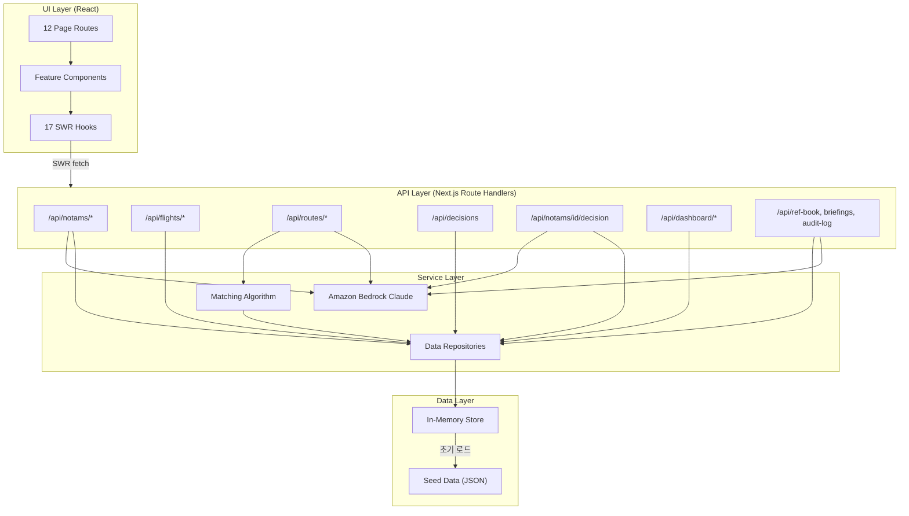
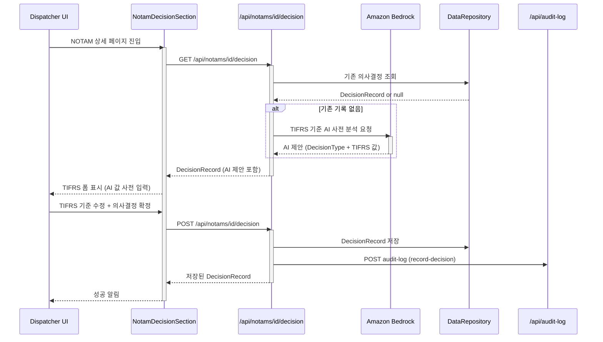
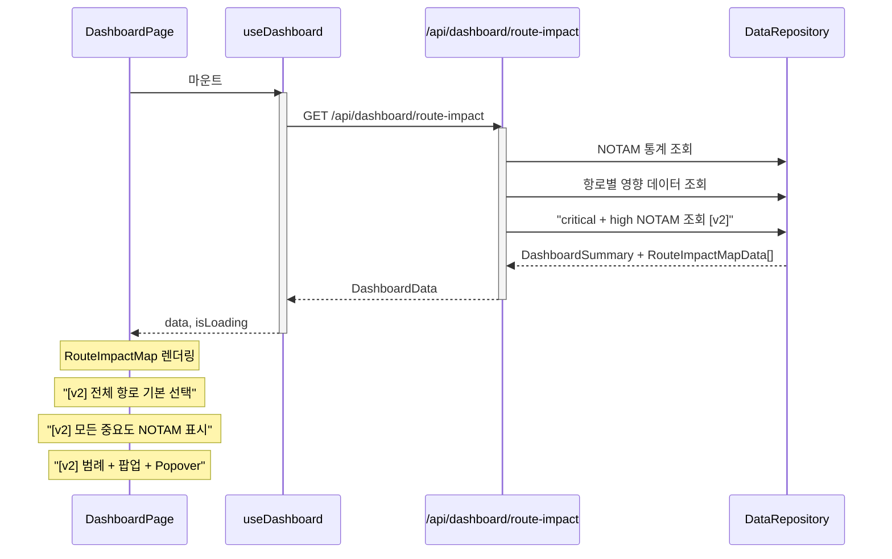
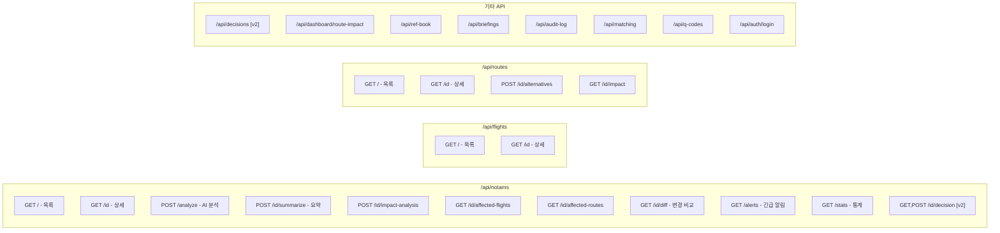

# NOTAM 분석 시스템 아키텍처 v2

> v1 아키텍처를 기반으로 FR-020 (TIFRS 의사결정 문서화) 추가 및 10개 FR의 [v2] 인수 기준 반영.
> 12개 페이지 라우트, 20개 FR 커버리지.

---

## 파트 1: 컴포넌트 트리

### 전체 애플리케이션 셸

```
RootLayout (src/app/layout.tsx)
├── "use client" providers
│   ├── AuthProvider
│   ├── NotificationProvider
│   └── AlertProvider
│
├── TopNavigation (AppLayout 외부 — Cloudscape 규칙)
│   ├── identity: "NOTAM 분석 시스템"
│   └── utilities: 알림, 교대근무, 프로필
│
└── AppLayout
    ├── navigation: SideNavigation
    │   ├── 운항 현황
    │   │   ├── 대시보드 (/)
    │   │   ├── NOTAM 목록 (/notams)
    │   │   └── 운항편 (/flights)
    │   ├── 항로 관리
    │   │   └── 항로 목록 (/routes)
    │   ├── 문서 관리
    │   │   ├── REF BOOK (/ref-book)
    │   │   └── 브리핑 문서 (/briefings)
    │   └── 의사결정 및 관리          [v2 변경]
    │       ├── 의사결정 기록 (/decisions) [v2 신규]
    │       └── 감사 로그 (/audit-log)
    ├── breadcrumbs: BreadcrumbGroup
    ├── notifications: Flashbar
    └── content: {page}
```

### 페이지별 컴포넌트 트리

#### 1. 대시보드 (/) — Dashboard 패턴

```
DashboardPage                    [서버 컴포넌트]
├── CriticalAlertBanner          [클라이언트] Flashbar
│   └── AlertContext 사용
├── DashboardSummaryCards         [클라이언트]
│   └── Container, ColumnLayout, StatusIndicator
├── RouteImpactMap               [클라이언트] [v2 구현완료]
│   ├── Container, Header, Select, Popover
│   ├── LeafletMapWrapper (동적 import)
│   │   └── LeafletMapInner     [v2 구현완료]
│   │       ├── CSS ES 모듈 import
│   │       └── 마커 아이콘 수정
│   ├── [v2] 지도 범례 (중요도별 색상)
│   ├── [v2] NOTAM 원형 팝업 (클릭 시)
│   ├── [v2] 헤더 정보 Popover
│   └── [v2] 항로 드롭다운 '전체' 옵션
├── RecentCriticalNotams          [클라이언트] [v2 구현완료]
│   └── [v2] critical+high 필터
└── AffectedFlightsSummary        [클라이언트]
    └── Container, Table, StatusIndicator
```

#### 2. NOTAM 목록 (/notams) — Table View 패턴

```
NotamListPage                    [서버 컴포넌트]
├── NotamTable                   [클라이언트]
│   ├── Table + useCollection
│   ├── PropertyFilter, Pagination
│   ├── ImportanceBadge          [공유]
│   └── NotamExpiryIndicator     [공유]
└── NotamSplitPanelDetail        [클라이언트]
    └── SplitPanel, KeyValuePairs
```

#### 3. NOTAM 상세 (/notams/[id]) — Detail 패턴

```
NotamDetailPage                  [서버 컴포넌트]
├── NotamRawAndParsed            [클라이언트]
│   └── Container, ColumnLayout, KeyValuePairs
├── NotamAiAnalysis              [클라이언트]
│   ├── ExpandableSection (AI 분석)
│   └── ImportanceBadge          [공유]
├── NotamImpactSection           [클라이언트]
│   └── Tabs (영향 항로 / 영향 운항편)
├── NotamMiniMap                 [클라이언트] [v2 구현완료]
│   └── [v2] 중요도 기반 색상 코딩
├── NotamDiffView                [클라이언트]
│   └── NOTAMR 교체 시 차이점 표시
└── NotamDecisionSection         [클라이언트] [v2 신규]
    ├── TIFRS 기준 폼 (T/I/F/R/S)
    ├── AI 제안 의사결정 표시
    ├── FormField, Input, Textarea, Select
    ├── ExpandableSection (AI 근거)
    └── Button (의사결정 기록)
```

#### 4. 운항편 목록 (/flights) — Table View 패턴

```
FlightListPage                   [서버 컴포넌트]
└── FlightTable                  [클라이언트] [v2 구현완료]
    ├── Table + useCollection
    └── [v2] 상태 컬럼 Popover
```

#### 5. 운항편 상세 (/flights/[id]) — Detail 패턴

```
FlightDetailPage                 [서버 컴포넌트]
├── FlightInfo                   [클라이언트]
│   └── KeyValuePairs, StatusIndicator
├── FlightNotamImpact            [클라이언트]
│   └── Table (영향 NOTAM 목록)
├── FlightRouteMap               [클라이언트] [v2 구현완료]
│   ├── [v2] 중요도별 NOTAM 원형 색상
│   └── [v2] 클릭 팝업 (요약+상세 링크)
├── FlightBriefingActions        [클라이언트]
│   └── 브리핑 생성 버튼
└── RouteDeviationGuidance       [클라이언트]
    └── AI 대안 항로 제안
```

#### 6. 항로 목록 (/routes) — Table View 패턴

```
RouteListPage                    [서버 컴포넌트]
└── RouteTable                   [클라이언트] [v2 구현완료]
    ├── Table + useCollection
    └── [v2] 상태 컬럼 Popover
```

#### 7. 항로 상세 (/routes/[id]) — Detail 패턴

```
RouteDetailPage                  [서버 컴포넌트]
├── RouteInfo                    [클라이언트]
├── RouteMapVisualization        [클라이언트]
├── RouteNotamImpacts            [클라이언트]
└── RouteAlternatives            [클라이언트]
```

#### 8. REF BOOK (/ref-book) — Table + Form 패턴

```
RefBookPage                      [서버 컴포넌트]
├── RefBookTable                 [클라이언트]
│   └── Table + useCollection
└── RefBookRegistrationModal     [클라이언트]
    └── Modal, Form, FormField
```

#### 9. 브리핑 문서 (/briefings) — Table View 패턴

```
BriefingListPage                 [서버 컴포넌트]
└── BriefingTable                [클라이언트]
    └── Table + useCollection
```

#### 10. 브리핑 상세 (/briefings/[id]) — Detail 패턴

```
BriefingDetailPage               [서버 컴포넌트]
├── BriefingInfo                 [클라이언트]
├── BriefingContentPreview       [클라이언트]
│   └── Tabs (유형별 콘텐츠)
└── BriefingApprovalActions      [클라이언트]
```

#### 11. 감사 로그 (/audit-log) — Table View 패턴

```
AuditLogPage                     [서버 컴포넌트]
└── AuditLogTable                [클라이언트]
    └── Table + useCollection
```

#### 12. 의사결정 기록 (/decisions) — Table View 패턴 [v2 신규]

```
DecisionListPage                 [서버 컴포넌트]  [v2 신규]
├── DecisionTable                [클라이언트]     [v2 신규]
│   ├── Table + useCollection
│   ├── PropertyFilter (의사결정 유형, 날짜)
│   ├── DecisionTypeBadge       [공유] [v2 신규]
│   └── Link (NOTAM 상세 페이지)
└── DecisionSplitPanelDetail    [클라이언트]     [v2 신규]
    ├── SplitPanel
    ├── TIFRS 기준 5개 필드 표시
    └── AI 제안 vs 확정 비교
```

### 공유 컴포넌트

```
src/components/common/
├── ImportanceBadge.tsx          Badge (중요도 색상)
├── ImportanceScoreBar.tsx       ProgressBar (점수 바)
├── NotamExpiryIndicator.tsx     StatusIndicator (만료 표시)
├── AirportLabel.tsx             Box, Popover (공항 정보)
├── LeafletMapWrapper.tsx        동적 import 래퍼
├── LeafletMapInner.tsx          Leaflet 맵 [v2 구현완료]
├── LoadingState.tsx             Spinner
├── ErrorState.tsx               Alert
└── DecisionTypeBadge.tsx        Badge [v2 신규]
```

---

## 파트 2: 데이터 플로우

### 2.1 전체 아키텍처 개요



### 2.2 FR-020 TIFRS 의사결정 흐름 [v2 신규]



### 2.3 대시보드 데이터 흐름 (v2 업데이트)



### 2.4 API 라우트 구조



---

## 파트 3: 요구사항 커버리지 매트릭스

| FR ID | 페이지 | 주요 컴포넌트 | API 라우트 | 훅 | v2 상태 |
|-------|--------|--------------|------------|-----|---------|
| FR-001 | /notams, /notams/[id] | NotamTable, NotamAiAnalysis, ImportanceBadge | /api/notams, /api/notams/analyze | useNotams, useNotamAnalysis | [v2] 색상 일관성 |
| FR-002 | /notams, /notams/[id] | NotamTable, NotamRawAndParsed, NotamSplitPanelDetail | /api/notams/[id], /api/q-codes | useNotam | 변경 없음 |
| FR-003 | /notams/[id] | NotamAiAnalysis, NotamImpactSection | /api/notams/[id]/impact-analysis | useNotam | [v2] 분석 단계 분리 |
| FR-004 | /flights, /flights/[id], /notams/[id] | FlightTable, FlightNotamImpact, NotamImpactSection | /api/notams/[id]/affected-flights, /api/flights/[id] | useFlights, useFlight | 변경 없음 |
| FR-005 | /, /notams | DashboardSummaryCards, NotamTable, RecentCriticalNotams | /api/notams, /api/notams/stats | useNotams, useDashboard | [v2] critical+high 구현완료 |
| FR-006 | /, /routes, /routes/[id] | RouteImpactMap, DashboardSummaryCards, AffectedFlightsSummary, RouteTable | /api/dashboard/route-impact, /api/routes | useDashboard, useRoutes | [v2] 범례/팝업/전체 구현완료 |
| FR-007 | /briefings, /briefings/[id], /flights/[id] | BriefingTable, BriefingInfo, BriefingContentPreview, BriefingApprovalActions | /api/briefings, /api/briefings/generate | useBriefings, useGenerateBriefing | 변경 없음 |
| FR-008 | /briefings, /briefings/[id], /flights/[id] | BriefingTable, BriefingContentPreview, FlightBriefingActions | /api/briefings/generate-crew, /api/briefings/[id]/crew-package | useBriefings, useGenerateBriefing | 변경 없음 |
| FR-009 | /flights/[id], /routes/[id] | RouteDeviationGuidance, FlightRouteMap, RouteAlternatives | /api/routes/[id]/alternatives | useRouteAlternatives | [v2] 맵 색상/팝업 구현완료 |
| FR-010 | /routes, /routes/[id] | RouteTable, RouteNotamImpacts, RouteMapVisualization | /api/matching/*, /api/routes/[id]/impact | useRoutes, useRoute | [v2] 상태 Popover 구현완료 |
| FR-011 | /ref-book | RefBookTable, RefBookRegistrationModal | /api/ref-book, /api/ref-book/[id] | useRefBook | [v2] 워크플로우 순서 명시 |
| FR-012 | /notams/[id] | NotamRawAndParsed, NotamAiAnalysis, NotamMiniMap | /api/notams/[id] | useNotam | [v2] 미니맵 색상 구현완료 |
| FR-013 | /flights, /flights/[id] | FlightTable, FlightInfo | /api/flights, /api/flights/[id] | useFlights, useFlight | [v2] 상태 Popover 구현완료 |
| FR-014 | /briefings | BriefingTable | /api/reports/shift-handover | useBriefings | 변경 없음 |
| FR-015 | /notams/[id] | NotamAiAnalysis | /api/notams/[id]/summarize | useNotam | 변경 없음 |
| FR-016 | / | CriticalAlertBanner, RecentCriticalNotams | /api/notams/alerts | useDashboard | 변경 없음 |
| FR-017 | /audit-log | AuditLogTable | /api/audit-log | useAuditLog | [v2] record-decision 액션 추가 |
| FR-018 | /notams/[id] | NotamDiffView | /api/notams/[id]/diff | useNotam | 변경 없음 |
| FR-019 | /notams | NotamTable, NotamExpiryIndicator | /api/notams | useNotams | 변경 없음 |
| FR-020 | /notams/[id], /decisions | NotamDecisionSection, DecisionTable, DecisionSplitPanelDetail, DecisionTypeBadge | /api/notams/[id]/decision, /api/decisions | useNotamDecision, useRecordDecision, useDecisions | **v2 신규** |

---

## v2 변경 요약

### 신규 추가

| 구분 | 항목 | 파일 경로 |
|------|------|-----------|
| 페이지 | /decisions (의사결정 기록 목록) | src/app/decisions/page.tsx |
| 컴포넌트 | NotamDecisionSection | src/components/notams/NotamDecisionSection.tsx |
| 컴포넌트 | DecisionTable | src/components/decisions/DecisionTable.tsx |
| 컴포넌트 | DecisionSplitPanelDetail | src/components/decisions/DecisionSplitPanelDetail.tsx |
| 컴포넌트 | DecisionTypeBadge | src/components/common/DecisionTypeBadge.tsx |
| API | GET,POST /api/notams/[id]/decision | src/app/api/notams/[id]/decision/route.ts |
| API | GET /api/decisions | src/app/api/decisions/route.ts |
| 훅 | useDecisions | src/hooks/useDecisions.ts |
| 훅 | useNotamDecision | src/hooks/useNotamDecision.ts |
| 훅 | useRecordDecision | src/hooks/useRecordDecision.ts |
| 타입 | DecisionRecord | src/types/decision.ts |
| 타입 | CreateDecisionRecordRequest | src/types/decision.ts |
| Enum | DecisionType | src/types/decision.ts |

### 이미 구현된 변경 (v2_status: implemented)

| 컴포넌트 | 변경 내용 | 관련 FR |
|----------|-----------|---------|
| RouteImpactMap | 범례, 팝업, Popover, 전체 옵션, 전체 NOTAM 표시, wrapper div | FR-006 |
| FlightRouteMap | 중요도별 색상, 클릭 팝업 | FR-009 |
| LeafletMapInner | CSS ES module import, 마커 아이콘 수정 | NFR-008 |
| RouteTable | 상태 컬럼 info Popover | FR-010 |
| FlightTable | 상태 컬럼 info Popover | FR-013 |
| RecentCriticalNotams | critical+high 필터 | FR-005 |
| Dashboard API | criticalNotams에 high 포함 | FR-006 |
| NotamMiniMap | 중요도 기반 색상 코딩 | FR-012 |

---

## 디렉토리 구조

```
src/
├── app/
│   ├── layout.tsx
│   ├── page.tsx                    (대시보드)
│   ├── notams/
│   │   ├── page.tsx                (NOTAM 목록)
│   │   └── [id]/page.tsx           (NOTAM 상세)
│   ├── flights/
│   │   ├── page.tsx                (운항편 목록)
│   │   └── [id]/page.tsx           (운항편 상세)
│   ├── routes/
│   │   ├── page.tsx                (항로 목록)
│   │   └── [id]/page.tsx           (항로 상세)
│   ├── ref-book/page.tsx           (REF BOOK)
│   ├── briefings/
│   │   ├── page.tsx                (브리핑 목록)
│   │   └── [id]/page.tsx           (브리핑 상세)
│   ├── audit-log/page.tsx          (감사 로그)
│   ├── decisions/page.tsx          [v2 신규]
│   └── api/
│       ├── notams/
│       │   ├── route.ts
│       │   ├── analyze/route.ts
│       │   ├── alerts/route.ts
│       │   ├── stats/route.ts
│       │   └── [id]/
│       │       ├── route.ts
│       │       ├── summarize/route.ts
│       │       ├── impact-analysis/route.ts
│       │       ├── affected-flights/route.ts
│       │       ├── affected-routes/route.ts
│       │       ├── diff/route.ts
│       │       └── decision/route.ts  [v2 신규]
│       ├── flights/
│       ├── routes/
│       ├── decisions/route.ts       [v2 신규]
│       ├── dashboard/
│       ├── ref-book/
│       ├── briefings/
│       ├── reports/
│       ├── matching/
│       ├── q-codes/
│       ├── audit-log/
│       └── auth/
├── components/
│   ├── layout/
│   │   └── AppShell.tsx
│   ├── dashboard/
│   │   ├── CriticalAlertBanner.tsx
│   │   ├── DashboardSummaryCards.tsx
│   │   ├── RouteImpactMap.tsx       [v2 수정됨]
│   │   ├── RecentCriticalNotams.tsx  [v2 수정됨]
│   │   └── AffectedFlightsSummary.tsx
│   ├── notams/
│   │   ├── NotamTable.tsx
│   │   ├── NotamSplitPanelDetail.tsx
│   │   ├── NotamRawAndParsed.tsx
│   │   ├── NotamAiAnalysis.tsx
│   │   ├── NotamImpactSection.tsx
│   │   ├── NotamMiniMap.tsx         [v2 수정됨]
│   │   ├── NotamDiffView.tsx
│   │   └── NotamDecisionSection.tsx [v2 신규]
│   ├── flights/
│   │   ├── FlightTable.tsx          [v2 수정됨]
│   │   ├── FlightInfo.tsx
│   │   ├── FlightNotamImpact.tsx
│   │   ├── FlightRouteMap.tsx       [v2 수정됨]
│   │   ├── FlightBriefingActions.tsx
│   │   └── RouteDeviationGuidance.tsx
│   ├── routes/
│   │   ├── RouteTable.tsx           [v2 수정됨]
│   │   ├── RouteInfo.tsx
│   │   ├── RouteMapVisualization.tsx
│   │   ├── RouteNotamImpacts.tsx
│   │   └── RouteAlternatives.tsx
│   ├── ref-book/
│   │   ├── RefBookTable.tsx
│   │   └── RefBookRegistrationModal.tsx
│   ├── briefings/
│   │   ├── BriefingTable.tsx
│   │   ├── BriefingInfo.tsx
│   │   ├── BriefingContentPreview.tsx
│   │   └── BriefingApprovalActions.tsx
│   ├── audit-log/
│   │   └── AuditLogTable.tsx
│   ├── decisions/                   [v2 신규]
│   │   ├── DecisionTable.tsx
│   │   └── DecisionSplitPanelDetail.tsx
│   └── common/
│       ├── ImportanceBadge.tsx
│       ├── ImportanceScoreBar.tsx
│       ├── NotamExpiryIndicator.tsx
│       ├── AirportLabel.tsx
│       ├── LeafletMapWrapper.tsx
│       ├── LeafletMapInner.tsx      [v2 수정됨]
│       ├── LoadingState.tsx
│       ├── ErrorState.tsx
│       └── DecisionTypeBadge.tsx    [v2 신규]
├── types/
│   ├── notam.ts
│   ├── flight.ts
│   ├── route.ts
│   ├── airport.ts
│   ├── briefing.ts
│   ├── auditLog.ts
│   ├── qCode.ts
│   ├── impact.ts
│   ├── dashboard.ts
│   ├── auth.ts
│   └── decision.ts                 [v2 신규]
├── hooks/
│   ├── useNotams.ts
│   ├── useNotam.ts
│   ├── useNotamAnalysis.ts
│   ├── useFlights.ts
│   ├── useFlight.ts
│   ├── useRoutes.ts
│   ├── useRoute.ts
│   ├── useRefBook.ts
│   ├── useBriefings.ts
│   ├── useBriefing.ts
│   ├── useDashboard.ts
│   ├── useAuditLog.ts
│   ├── useGenerateBriefing.ts
│   ├── useRouteAlternatives.ts
│   ├── useDecisions.ts             [v2 신규]
│   ├── useNotamDecision.ts         [v2 신규]
│   └── useRecordDecision.ts        [v2 신규]
├── contexts/
│   ├── NotificationContext.tsx
│   ├── AlertContext.tsx
│   └── AuthContext.tsx
├── lib/
│   ├── db/
│   ├── services/
│   └── validation/
└── data/
```

---

## 검증 체크리스트

- [x] 모든 20개 FR이 requirements_coverage에 매핑됨
- [x] 모든 12개 라우트에 유효한 Cloudscape 패턴 참조
- [x] 고아 컴포넌트 없음 (모든 컴포넌트가 페이지 또는 부모에 사용됨)
- [x] TopNavigation이 AppLayout 외부 (루트 레이아웃)
- [x] 모든 데이터 엔티티에 TypeScript 타입 정의
- [x] 디렉토리 경로가 src/components/{feature}/{ComponentName}.tsx 규칙 준수
- [x] 라우트 20개 미만 (12개)
- [x] 이미 구현된 v2 변경사항에 v2_status: implemented 표시
- [x] FR-020 신규 추가 항목에 v2_status: new 표시
