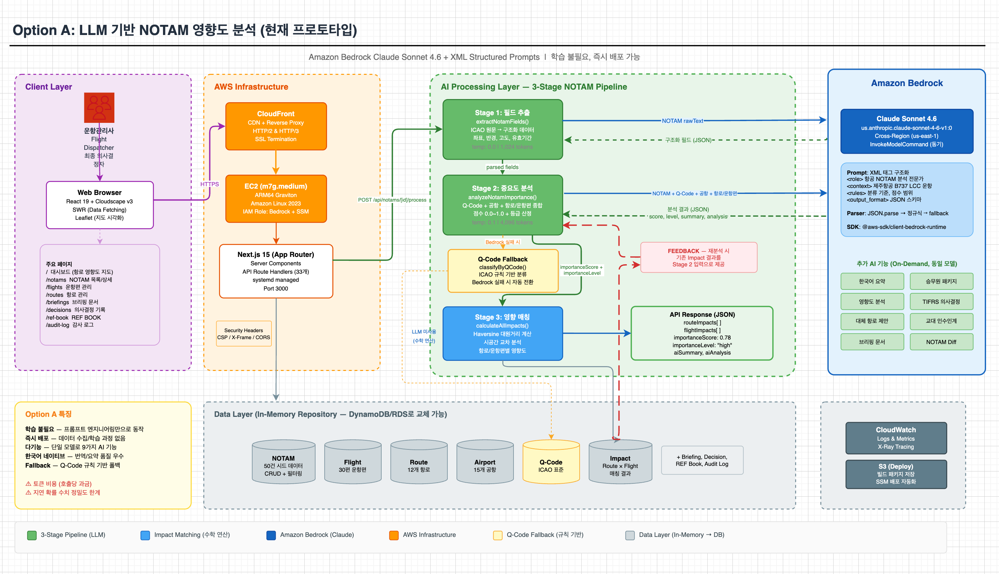
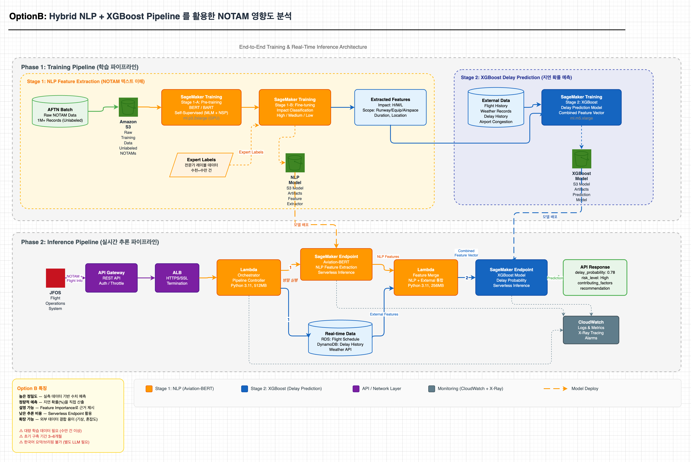

# AI NOTAM 분석 시스템 프로토타입

> 운항관리사의 NOTAM 분석 업무를 AI로 자동화하는 웹 애플리케이션 프로토타입

## 빠른 시작

```bash
# 의존성 설치
npm install

# 환경 변수 설정
cp .env.local.example .env.local
# .env.local 파일에 AWS 자격 증명 설정 (아래 환경 변수 섹션 참조)

# 개발 서버 실행
npm run dev
```

브라우저에서 http://localhost:3000 을 열어 확인합니다.

프로토타입 로그인 화면에서 아무 사번/비밀번호를 입력하면 진입됩니다 (mock 인증).

## 기술 스택

| 기술 | 버전 | 용도 |
|------|------|------|
| Next.js | 15 (App Router) | 풀스택 프레임워크 |
| React | 19 | UI 라이브러리 |
| TypeScript | 5+ (strict mode) | 타입 안전성 |
| Cloudscape Design System | v3+ | AWS 스타일 UI 컴포넌트 |
| Amazon Bedrock | Claude Sonnet 4.6 | AI NOTAM 분석 (실제 호출) |
| Leaflet + react-leaflet | 1.9 / 5.0 | 항로/NOTAM 지도 시각화 |
| SWR | 2.4 | 클라이언트 데이터 패칭 |
| zod | 4.3 | API 입력 검증 |

## AI 기능 (Amazon Bedrock — Claude Sonnet 4.6)

모든 AI 기능은 Amazon Bedrock의 Claude Sonnet 4.6 (`us.anthropic.claude-sonnet-4-6-v1:0`)을 통해 실제 LLM 호출로 동작합니다. Mocking 금지 원칙에 따라 실제 Bedrock API 호출이 필수이며, API 실패 시 Q-Code 규칙 기반 폴백으로 전환됩니다.

| # | 기능 | 설명 | API 엔드포인트 |
|---|------|------|----------------|
| 1 | **NOTAM 중요도 분석** | Q-Code, 공항 인프라, 유효 기간, 영향 항로/운항편을 종합하여 0.0~1.0 중요도 점수와 등급을 산정 | `POST /api/notams/analyze` |
| 2 | **NOTAM 필드 추출** | ICAO NOTAM 원문에서 좌표, 반경, 고도, 유효시간 등 구조화 필드를 자동 파싱 | `POST /api/notams/[id]/process` |
| 3 | **한국어 요약 생성** | ICAO 약어를 풀어 설명하는 전문 한국어 번역/요약 | `POST /api/notams/[id]/summarize` |
| 4 | **영향도 분석** | 항로/운항편 영향 데이터와 공항 인프라를 결합한 맥락적 종합 영향 분석 보고서 생성 | `POST /api/notams/[id]/impact-analysis` |
| 5 | **대체 항로 제안** | NOTAM 영향 회피를 위한 대체 항로 분석, 거리/시간 차이 비교 및 종합 권고 | `POST /api/routes/[id]/alternatives` |
| 6 | **브리핑 문서 생성** | 운항관리사/승무원용 출발·도착 브리핑 문서 자동 생성 (브리핑 유형별 최적화) | `POST /api/briefings/generate` |
| 7 | **승무원 패키지 생성** | DISP Comment, Company NOTAM, Crew Briefing 3가지 문서를 JSON 구조화 출력으로 일괄 생성 | `POST /api/briefings/generate-crew` |
| 8 | **TIFRS 의사결정 분석** | Time·Impact·Facilities·Route·Schedule 5가지 기준으로 NOTAM 영향을 평가하고 의사결정 유형 제안 | `GET/POST /api/notams/[id]/decision` |
| 9 | **교대 인수인계 보고서** | 교대 시간대의 NOTAM 현황을 종합하여 다음 근무자를 위한 인수인계 보고서 생성 | `POST /api/reports/shift-handover` |

### AI 아키텍처

- **프롬프트**: XML 태그 기반 구조화 프롬프트 (`src/lib/ai/prompts/system.ts`, `templates.ts`)
- **서비스**: Bedrock Runtime API 래퍼 (`src/lib/services/bedrock.service.ts`)
- **파서**: JSON 구조화 출력 파서 (`src/lib/ai/parsers/`)
- **Temperature**: 0.0~0.4 (기능별 최적화, 기본 0.2)
- **Max Tokens**: 1,024~6,144 (기능별 조정)
- **폴백**: Bedrock API 실패 시 Q-Code 규칙 기반 분류로 전환

### 아키텍처 로드맵 — Option A → Option B

현재 프로토타입은 **Option A (LLM 기반)** 으로 구현되어 있으며, 향후 정밀도 고도화를 위해 **Option B (Hybrid ML 파이프라인)** 으로 발전할 수 있습니다. 각 옵션의 상세 아키텍처는 `docs/` 폴더의 draw.io 다이어그램을 참조하세요.

#### Option A: LLM 기반 NOTAM 분석 (현재 프로토타입)

> 아키텍처 다이어그램: [`docs/notam-llm-architecture.drawio`](docs/notam-llm-architecture.drawio)



- Amazon Bedrock **Claude Sonnet 4.6** + XML 구조화 프롬프트
- **3-Stage Pipeline**: 필드 추출 (LLM) → 중요도 분석 (LLM) → 영향 매칭 (Haversine 수학 연산)
- Bedrock 실패 시 Q-Code 규칙 기반 폴백으로 무중단 분석 보장

#### Option B: Hybrid NLP + XGBoost (고도화 방안)

> 아키텍처 다이어그램: [`docs/notam-ml-architecture.drawio`](docs/notam-ml-architecture.drawio)



- **BERT or BART 계열의 모델** 사전학습/파인튜닝 (SageMaker) + **XGBoost** 지연 확률 예측
- **2-Phase 구성**: Training Pipeline (데이터 수집 → 학습) + Inference Pipeline (실시간 추론)
- NLP 특징 추출과 외부 데이터(기상, 혼잡도) 조회를 병렬 실행 후 통합 예측

#### 옵션 비교

| 항목 | Option A (LLM) | Option B (Hybrid ML) |
|------|----------------|----------------------|
| **구현 상태** | 현재 프로토타입 | 고도화 제안 |
| **핵심 기술** | Bedrock Claude Sonnet 4.6 | Aviation-BERT + XGBoost |
| **구축 기간** | 즉시 (프롬프트 엔지니어링) | 3~6개월 (데이터 수집 + 학습) |
| **학습 데이터** | 불필요 | 수만 건 이상 필요 |
| **지연 예측 정밀도** | 정성적 (등급) | 정량적 (확률 %) |
| **한국어 요약/브리핑** | 네이티브 지원 (9가지 기능) | 별도 LLM 연동 필요 |
| **추론 비용** | 토큰 단위 과금 | Serverless Endpoint (저비용) |
| **설명 가능성** | AI 분석 텍스트 | Feature Importance 수치 |

## 프로젝트 구조

```
src/
├── app/                    # Next.js App Router 페이지 및 API
│   ├── layout.tsx          # 루트 레이아웃
│   ├── page.tsx            # 대시보드 (홈)
│   ├── notams/             # NOTAM 목록/상세
│   ├── flights/            # 운항편 목록/상세
│   ├── routes/             # 항로 목록/상세
│   ├── ref-book/           # REF BOOK 관리
│   ├── briefings/          # 브리핑 문서
│   ├── decisions/          # 의사결정 기록
│   ├── audit-log/          # 감사 로그
│   └── api/                # API Route Handlers (33개)
├── components/             # Cloudscape UI 컴포넌트
│   ├── common/             # 공용 컴포넌트 (ImportanceBadge 등)
│   ├── dashboard/          # 대시보드 위젯
│   ├── notams/             # NOTAM 관련
│   ├── flights/            # 운항편 관련
│   ├── routes/             # 항로 관련
│   ├── briefings/          # 브리핑 관련
│   ├── decisions/          # 의사결정 관련
│   ├── ref-book/           # REF BOOK 관련
│   ├── audit-log/          # 감사 로그 관련
│   └── layout/             # AppShell, Providers
├── types/                  # 공유 TypeScript 인터페이스 (13개)
├── lib/
│   ├── ai/                 # Bedrock 프롬프트 및 파서
│   ├── db/                 # 인메모리 리포지토리 (11개)
│   ├── services/           # 비즈니스 로직 (bedrock, matching, qCode, notamDiff)
│   └── validation/         # zod 검증 스키마 (9개)
├── data/                   # 시드 데이터 (50 NOTAMs, 12 항로, 30 운항편, 15 공항)
├── hooks/                  # SWR 기반 API 호출 훅 (18개)
├── contexts/               # React Context (Auth, Alert, Notification)
└── middleware.ts           # 보안 헤더 미들웨어
```

## 주요 페이지

| 경로 | 페이지 | 설명 |
|------|--------|------|
| `/` | 대시보드 | 항로 영향도 지도, 중요 NOTAM 알림, 영향 운항편 요약 |
| `/notams` | NOTAM 목록 | PropertyFilter 기반 필터링, 중요도 배지, Split Panel 상세 |
| `/notams/[id]` | NOTAM 상세 | 원문/파싱, AI 분석, 영향 항로/운항편, 미니맵, 의사결정 |
| `/flights` | 운항편 목록 | 운항편 테이블, NOTAM 영향 상태 |
| `/flights/[id]` | 운항편 상세 | 운항 정보, NOTAM 영향 지도, 대체 항로 제안 |
| `/routes` | 항로 목록 | 항로 테이블, 상태 설명 팝오버 |
| `/routes/[id]` | 항로 상세 | 항로 정보, 지도, NOTAM 영향, 대체 항로 |
| `/ref-book` | REF BOOK | 중요 NOTAM 등재/관리 |
| `/briefings` | 브리핑 문서 | 출발/도착 브리핑 자동 생성, 승무원 패키지 |
| `/decisions` | 의사결정 기록 | TIFRS 기반 의사결정 목록, 상세 조회 |
| `/audit-log` | 감사 로그 | 모든 운항관리사 행동 기록 |

## API 엔드포인트

### NOTAM
| Method | Path | 설명 |
|--------|------|------|
| GET | `/api/notams` | NOTAM 목록 (필터링, 정렬, 페이지네이션) |
| GET | `/api/notams/stats` | NOTAM 중요도별 통계 |
| GET | `/api/notams/alerts` | Critical NOTAM 알림 목록 |
| POST | `/api/notams/analyze` | AI 중요도 분석 실행 |
| POST | `/api/notams/process-all` | 전체 NOTAM 일괄 처리 |
| GET | `/api/notams/[id]` | NOTAM 상세 조회 |
| POST | `/api/notams/[id]/process` | 개별 NOTAM 3단계 파이프라인 처리 |
| POST | `/api/notams/[id]/summarize` | AI 한국어 요약 생성 |
| POST | `/api/notams/[id]/impact-analysis` | AI 종합 영향 분석 |
| GET | `/api/notams/[id]/affected-flights` | 영향 운항편 조회 |
| GET | `/api/notams/[id]/affected-routes` | 영향 항로 조회 |
| GET | `/api/notams/[id]/diff` | NOTAMR 변경 비교 |
| GET/POST | `/api/notams/[id]/decision` | TIFRS 의사결정 조회/기록 |

### 운항편/항로
| Method | Path | 설명 |
|--------|------|------|
| GET | `/api/flights` | 운항편 목록 |
| GET | `/api/flights/[id]` | 운항편 상세 |
| GET | `/api/routes` | 항로 목록 |
| GET | `/api/routes/[id]` | 항로 상세 |
| POST | `/api/routes/[id]/alternatives` | AI 대체 항로 제안 |
| GET | `/api/routes/[id]/impact` | 항로 NOTAM 영향도 |

### 대시보드/매칭
| Method | Path | 설명 |
|--------|------|------|
| GET | `/api/dashboard/route-impact` | 대시보드 항로 영향도 데이터 |
| POST | `/api/matching/calculate` | NOTAM-항로/운항편 매칭 실행 |
| GET | `/api/matching/results` | 매칭 결과 조회 |

### 문서/기록
| Method | Path | 설명 |
|--------|------|------|
| GET/POST | `/api/briefings` | 브리핑 목록/생성 |
| POST | `/api/briefings/generate` | AI 운항관리사 브리핑 생성 |
| POST | `/api/briefings/generate-crew` | AI 승무원 브리핑 생성 |
| GET | `/api/briefings/[id]` | 브리핑 상세 |
| GET | `/api/briefings/[id]/crew-package` | 승무원 패키지 조회 |
| GET/POST | `/api/ref-book` | REF BOOK 목록/등록 |
| PUT/DELETE | `/api/ref-book/[id]` | REF BOOK 수정/삭제 |
| GET/POST | `/api/reports/shift-handover` | 교대근무 보고서 목록/생성 |
| GET | `/api/reports/shift-handover/[id]` | 교대근무 보고서 상세 |
| GET | `/api/decisions` | 의사결정 기록 목록 |
| GET | `/api/audit-log` | 감사 로그 목록 |
| POST | `/api/audit-log` | 감사 로그 기록 |
| GET | `/api/q-codes` | Q-Code 참조 데이터 |
| POST | `/api/auth/login` | 로그인 (mock) |

## 환경 변수

`.env.local.example` 파일을 `.env.local`로 복사하고 설정합니다.

| 변수 | 필수 | 기본값 | 설명 |
|------|------|--------|------|
| `AWS_REGION` | O | `us-west-2` | Bedrock 모델 배포 리전 |
| `AWS_PROFILE` | - | `default` | 로컬 개발 시 AWS 프로파일 |
| `BEDROCK_MODEL_ID` | O | `us.anthropic.claude-sonnet-4-6-v1:0` | Bedrock 모델 ID |

AI 기능은 실제 Amazon Bedrock 호출을 사용합니다. AWS 자격 증명이 필요합니다:
- 로컬 개발: `aws configure` 또는 `AWS_PROFILE` 환경 변수
- EC2 배포: IAM Instance Role (권장)

필요한 IAM 권한: `bedrock:InvokeModel` (해당 모델에 대해)

## 주요 npm 명령어

| 명령어 | 설명 |
|--------|------|
| `npm run dev` | 개발 서버 (Turbopack) |
| `npm run build` | 프로덕션 빌드 |
| `npm run start` | 프로덕션 서버 |
| `npm run lint` | ESLint 검사 |
| `npm run format` | Prettier 포맷팅 |
| `npm run type-check` | TypeScript 타입 검사 |
| `npm run test:e2e` | Playwright E2E 테스트 (63개) |

## 배포 현황

현재 프로토타입은 다음 인프라에 배포되어 있습니다:

| 항목 | 값 |
|------|-----|
| URL | https://d37mgks0nq05m5.cloudfront.net |
| EC2 | `i-0304c7e37a51a9584` (us-east-1) |
| 앱 경로 | `/opt/notam-prototype/` |
| 프로세스 관리 | systemd (`notam-prototype.service`) |
| CDN | CloudFront (`E2IKESNE19WJOS`) |
| 배포 버킷 | `notam-prototype-deploy-163720405317` (S3) |

배포 상세는 `docs/SETUP.md`를 참조하세요.
