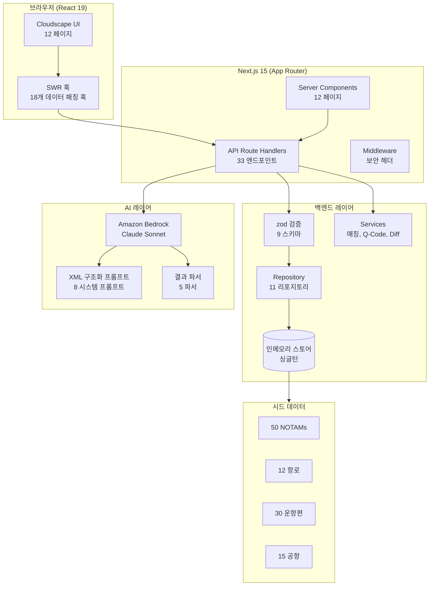
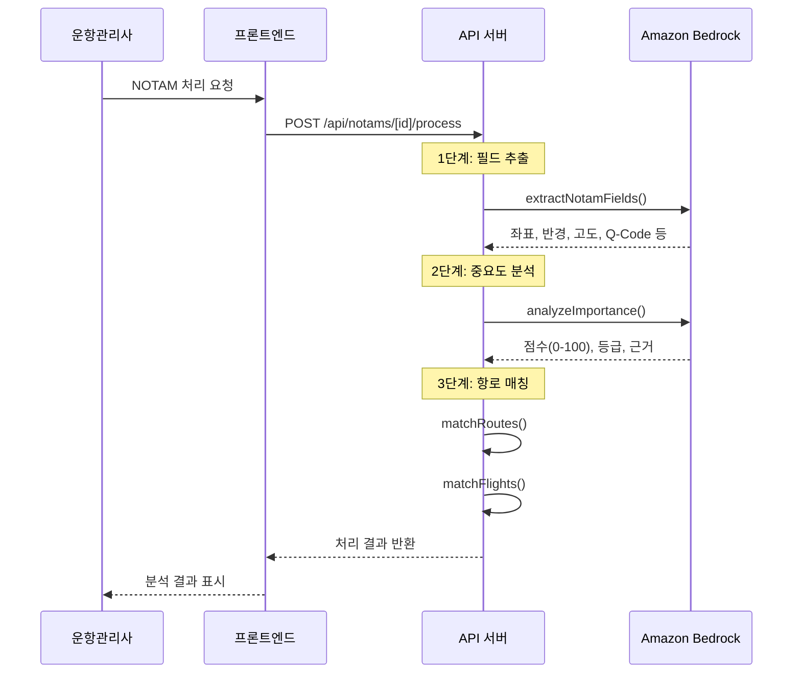

# 아키텍처 개요

## 설계 배경

운항관리사(Flight Dispatcher)는 하루 수천 건의 NOTAM을 AFTN을 통해 수신하며, 3명이 24시간 교대 근무로 수동 모니터링합니다. 비정형 텍스트와 ICAO 약어로 구성된 NOTAM 해석에 과도한 시간이 소요되고, 중요 NOTAM의 REF BOOK 등재, 브리핑 자료 작성, 항로 우회 의사결정 등 고부가가치 업무에 집중하지 못하는 문제가 있습니다.

이 프로토타입은 Amazon Bedrock Claude를 활용하여 NOTAM 분석을 자동화하고, 운항관리사가 의사결정에 집중할 수 있는 환경을 제공합니다.

### 핵심 요구사항 (20개 FR)

- **P0 (필수)**: 8개 - AI 중요도 분석, Q-Code 분류, 종합 영향 분석, 항로/운항편 매칭, 자동 필터링, 항로 영향 대시보드, 브리핑 생성, 매칭 알고리즘
- **P1 (중요)**: 8개 - 승무원 브리핑, 대체 항로 제안, REF BOOK, NOTAM 상세, 운항편 관리, 교대근무 보고서, 한국어 요약, 실시간 알림
- **P2 (선택)**: 4개 - 감사 로그, NOTAMR 변경 추적, 만료 관리, TIFRS 의사결정

## 시스템 아키텍처



## NOTAM 처리 파이프라인



## 컴포넌트 계층

```
RootLayout (src/app/layout.tsx)
├── Providers (AuthProvider, NotificationProvider, AlertProvider)
│
├── TopNavigation (AppLayout 외부 — Cloudscape 규칙)
│   ├── identity: "NOTAM 분석 시스템"
│   └── utilities: 알림, 교대근무, 프로필
│
└── AppLayout
    ├── navigation: SideNavigation
    │   ├── 운항 현황
    │   │   ├── 대시보드 (/)
    │   │   ├── NOTAM 목록 (/notams)
    │   │   └── 운항편 (/flights)
    │   ├── 항로 관리
    │   │   └── 항로 목록 (/routes)
    │   ├── 문서 관리
    │   │   ├── REF BOOK (/ref-book)
    │   │   └── 브리핑 문서 (/briefings)
    │   └── 의사결정 및 관리
    │       ├── 의사결정 기록 (/decisions)
    │       └── 감사 로그 (/audit-log)
    └── content: {page}
```

## 데이터 모델

### 핵심 엔티티

| 엔티티 | 파일 | 주요 필드 | 관계 |
|--------|------|----------|------|
| `Notam` | `types/notam.ts` | id, series, number, qCode, rawText, importance, aiAnalysis | 1:N → FlightImpact, RouteImpact, RefBookEntry, Decision |
| `Flight` | `types/flight.ts` | id, flightNumber, routeId, departureAirport, arrivalAirport, status | N:1 → Route, 1:N → FlightImpact |
| `Route` | `types/route.ts` | id, name, departureAirport, arrivalAirport, waypoints, status | 1:N → Flight, RouteImpact |
| `Airport` | `types/airport.ts` | id, icaoCode, name, runways, coordinates | N:M → Route, Flight |
| `RefBookEntry` | `types/refBook.ts` | id, notamId, registeredBy, status, notes | N:1 → Notam |
| `Briefing` | `types/briefing.ts` | id, type, flightId, content, status | N:1 → Flight |
| `DecisionRecord` | `types/decision.ts` | id, notamId, tifrs*, overallDecision, rationale | N:1 → Notam |
| `AuditLog` | `types/auditLog.ts` | id, userId, action, targetId, timestamp | - |
| `NotamRouteImpact` | `types/impact.ts` | notamId, routeId, overlapType, affectedSegments | N:1 → Notam, Route |
| `NotamFlightImpact` | `types/impact.ts` | notamId, flightId, impactType, severity | N:1 → Notam, Flight |

### 데이터 흐름

1. **시드 데이터** (`src/data/`) → 인메모리 스토어 (`src/lib/db/store.ts`) 로드
2. **Repository** (`src/lib/db/*.repository.ts`) → 스토어에 대한 CRUD 인터페이스
3. **API Route** → zod 검증 → Repository 호출 → JSON 응답
4. **SWR 훅** (`src/hooks/`) → API 호출 + 캐싱 + 자동 갱신
5. **UI 컴포넌트** → SWR 훅에서 데이터 수신 → Cloudscape 컴포넌트로 렌더링

## 상태 관리

| 관리 방식 | 용도 | 위치 |
|----------|------|------|
| SWR | 서버 데이터 캐싱 및 자동 갱신 | `src/hooks/` (18개 훅) |
| React Context | 전역 상태 (인증, 알림, 알림 배너) | `src/contexts/` (3개) |
| Component State | 로컬 UI 상태 (필터, 정렬, 선택) | 각 컴포넌트 내 `useState` |
| Server Components | 초기 데이터 로딩 | 페이지 컴포넌트 (server) |

## AI 아키텍처

### 모델 설정
- **SDK**: `@aws-sdk/client-bedrock-runtime` (직접 API 호출)
- **모델**: Claude Sonnet (cross-region inference)
- **패턴**: AI-Assisted Workflow (자율성 수준 5 이하 - 모든 결정은 운항관리사가 최종 확인)

### 시스템 프롬프트 (8개)

| 프롬프트 | 파일 | 용도 | 관련 FR |
|----------|------|------|---------|
| `NOTAM_IMPORTANCE_SYSTEM_PROMPT` | `lib/ai/prompts/system.ts` | 중요도 점수화 (0-100) | FR-001 |
| `NOTAM_FIELD_EXTRACTION_SYSTEM_PROMPT` | 동일 | NOTAM 필드 자동 추출 | FR-001 |
| `IMPACT_ANALYSIS_SYSTEM_PROMPT` | 동일 | 종합 영향 분석 | FR-003 |
| `KOREAN_SUMMARY_SYSTEM_PROMPT` | 동일 | 한국어 요약 | FR-015 |
| `getBriefingSystemPrompt()` | 동일 | 브리핑 문서 생성 | FR-007 |
| `SHIFT_HANDOVER_SYSTEM_PROMPT` | 동일 | 교대근무 보고서 | FR-014 |
| `ROUTE_ALTERNATIVES_SYSTEM_PROMPT` | 동일 | 대체 항로 제안 | FR-009 |
| `TIFRS_DECISION_SYSTEM_PROMPT` | 동일 | TIFRS 의사결정 분석 | FR-020 |

### 프롬프트 구조
모든 프롬프트는 XML 태그 기반 구조화를 사용합니다:
```xml
<system>역할 및 맥락</system>
<instructions>분석 지침</instructions>
<output_format>JSON 출력 스키마</output_format>
<examples>Few-shot 예시</examples>
```

### 결과 파서 (5개)
- `parseImportanceResult` — 중요도 점수 + 등급 + 근거
- `parseFieldExtractionResult` — 좌표, 반경, 고도, 유효기간
- `parseRouteAlternativesResult` — 대체 항로 목록
- `parseTifrsDecisionResult` — TIFRS 분석 결과
- `parseCrewPackageResult` — 승무원 브리핑 패키지

## 주요 설계 결정

| 결정 | 이유 | 대안 |
|------|------|------|
| 인메모리 싱글턴 스토어 | 프로토타입 빠른 개발, Repository 인터페이스로 DB 교체 용이 | DynamoDB — 프로덕션에서 교체 |
| SWR (stale-while-revalidate) | 자동 캐시 갱신, 낙관적 UI 업데이트, Next.js 호환 | React Query — 동등 기능 |
| Cloudscape Design System | AWS 콘솔 스타일 UI, 내장 WCAG 2.1 AA 접근성 | Material UI, Ant Design |
| Leaflet (동적 import) | SSR 방지, 가벼운 지도 라이브러리 | Mapbox — 더 많은 기능, 유료 |
| XML 구조화 프롬프트 | Claude 모델 최적, 일관된 JSON 출력 | 일반 텍스트 프롬프트 |
| Repository 패턴 | 데이터 접근 추상화, DB 교체 시 구현체만 변경 | 직접 ORM 호출 |
| Mock 인증 | 프로토타입 범위, Cognito 통합은 프로덕션에서 | Amazon Cognito |
| zod 검증 | 타입 안전 입력 검증, TypeScript 타입 추론 | Joi, Yup |
| 개별 Cloudscape import | 번들 크기 최적화, 트리쉐이킹 보장 | 배럴 import (비권장) |
| Server Components 기본 | 클라이언트 번들 최소화, "use client"는 필요한 곳만 | 전체 CSR |
